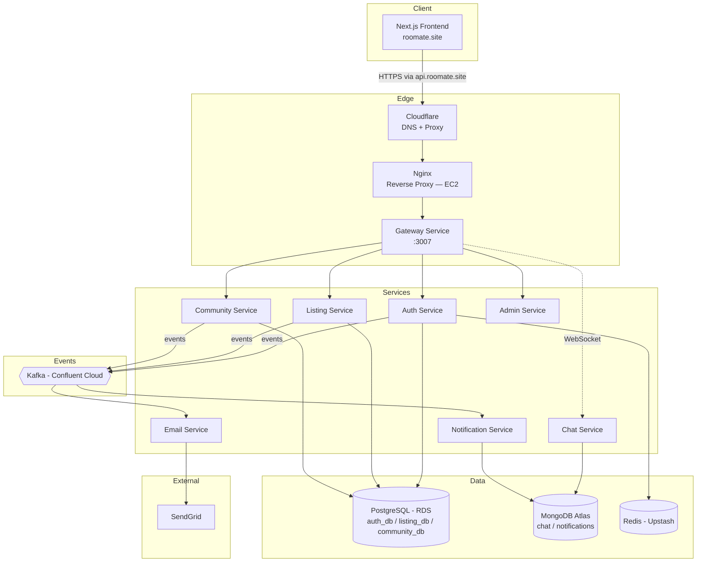

# RooMate 🏠

**Find your place. Feel at home.**

RooMate is a full-stack platform that helps students and young professionals find PGs, hostels, and roommates — replacing scattered WhatsApp groups and broker fees with verified listings, a trusted community, and real-time chat.

🔗 **Live:** [roomate.site](https://roomate.site)

---

## Table of Contents

- [Overview](#overview)
- [Architecture](#architecture)
- [Tech Stack](#tech-stack)
- [Services](#services)
- [Getting Started (Local Setup)](#getting-started-local-setup)
- [Testing](#testing)
- [Deployment](#deployment)
- [Documentation](#documentation)
- [Screenshots](#screenshots)
- [Author](#author)

---

## Overview

Finding a PG, hostel, or roommate as a student usually means scrolling through unreliable WhatsApp groups or paying broker fees for listings that may not even be accurate. RooMate solves this with:

- **Verified property listings** with photos, filters, and smart search
- **Roommate matching** through community pages
- **Real-time chat** between seekers and property owners
- **Admin-moderated approvals** for listings and communities, so the platform stays trustworthy
- **Instant notifications & emails** for every important event (approval, rejection, new message)

Built as a distributed system of **8 independent microservices**, RooMate is designed the way a real production platform would be — not a monolith, with each service owning its own data and communicating through events.

> 📄 The problem this project set out to solve — why students and bachelors are underserved by platforms like NoBroker or 99acres, which are built for families and full-apartment buyers, not for someone splitting rent on one bed near their college — is laid out in [`docs/problem-statement.md`](./docs/problem-statement.md).
>
> 🐛 Shipping this to production surfaced a series of real, gnarly infrastructure bugs — from Kafka reconnect storms, to unmigrated production databases, to a misleading Prisma error that turned out to be a raw SSL handshake failure. The full trail of problems and how each was diagnosed and fixed is documented in [`docs/deployment-experience.md`](./docs/deployment-experience.md) — worth a read if you want to see the debugging process, not just the finished product.

---

## Architecture

RooMate follows a **microservices architecture** with an API gateway, event-driven communication via Kafka, and a polyglot persistence strategy (the right database for each service's needs).



**Key design decisions:**

- **Database-per-service** — Auth, Listing, and Community each have their own isolated PostgreSQL database (no shared tables across services), enforcing true service boundaries.
- **MongoDB for Chat & Notification** — these services have flexible, high-write, less relational data (messages, notification feeds), which fits a document store better than relational tables.
- **Kafka for cross-service events** — instead of services calling each other directly, actions like `property.approved` or `community.rejected` are published as events, so Email and Notification services react independently without tight coupling.
- **Single Gateway entry point** — the frontend only ever talks to one service (`api.roomate.site`), which routes to the right backend service internally.
- **Cloudflare in front of `api.roomate.site`** — handles DNS and proxies traffic to the EC2 instance, adding SSL and a layer of protection in front of the backend, rather than exposing the instance's raw IP.
- **Nginx as reverse proxy on EC2** — sits behind Cloudflare and routes incoming requests to the Gateway service before they reach the Dockerized services.

> 📌 *A full architecture walkthrough with the reasoning behind each decision is in [`docs/architecture.md`](./docs/architecture.md).*

---

## Tech Stack

| Layer | Technology |
|---|---|
| **Frontend** | Next.js, React, Tailwind CSS — deployed on Vercel |
| **Backend** | NestJS (Node.js/TypeScript), 8 microservices |
| **Databases** | PostgreSQL (AWS RDS) · MongoDB (Atlas) |
| **Cache** | Redis (Upstash) |
| **Messaging** | Kafka (Confluent Cloud) |
| **Email** | SendGrid |
| **ORM** | Prisma (Postgres services) |
| **Infra** | Docker, Docker Compose, AWS EC2, Nginx (reverse proxy), Cloudflare (DNS + proxy) |
| **CI/CD** | GitHub Actions |
| **Auth** | JWT (access + refresh tokens) |

*(Full breakdown with reasoning for each choice in [`docs/tech-stack.md`](./docs/tech-stack.md).)*

---

## Services

| Service | Responsibility | Database | Docs |
|---|---|---|---|
| **Gateway** | Single entry point, routing, CORS, auth guard | — | [→](./docs/services/gateway.md) |
| **Auth** | Signup, login, JWT, email verification | PostgreSQL (`auth_db`) | [→](./docs/services/auth.md) |
| **Listing** | Property CRUD, search, filters | PostgreSQL (`listing_db`) | [→](./docs/services/listing.md) |
| **Community** | Roommate communities, requests | PostgreSQL (`community_db`) | [→](./docs/services/community.md) |
| **Admin** | Approve/reject listings & communities | — (BFF over other services) | [→](./docs/services/admin.md) |
| **Chat** | Real-time messaging (WebSocket) | MongoDB | [→](./docs/services/chat.md) |
| **Notification** | In-app notification feed | MongoDB | [→](./docs/services/notification.md) |
| **Email** | Transactional emails via SendGrid, Kafka consumer | — | [→](./docs/services/email.md) |

Each service doc includes: role & responsibilities, API reference (Swagger), ER diagram (where applicable), sequence diagram for its key flow, and test coverage.

**Swagger docs** are available per service in development at `http://localhost:<port>/docs`.

---

## Getting Started (Local Setup)

> Full step-by-step instructions: [`docs/local-setup.md`](./docs/local-setup.md)

```bash
# Clone the repo
git clone https://github.com/ShreyaGosavi/rooMate.git
cd rooMate

# Install dependencies
npm install --legacy-peer-deps

# Set up environment variables
cp .env.example .env
# fill in DATABASE_URLs, KAFKA_BROKER, SENDGRID_API_KEY, etc.

# Run all services with Docker Compose
docker compose up -d

# Or run the frontend separately
cd apps/web
npm run dev
```

---

## Testing

RooMate's services are covered by **137 tests** across unit and integration suites, run automatically in CI on every pull request via GitHub Actions.

*(See [`docs/services/`](./docs/services/) for the per-service breakdown of test counts and coverage.)*

---

## Deployment

- **Frontend** — deployed on Vercel, auto-deploys from `main`
- **Backend** — 8 services running via Docker Compose on a single AWS EC2 instance
- **Databases** — AWS RDS (Postgres), MongoDB Atlas, Upstash (Redis + Kafka via Confluent Cloud)

Full deployment architecture, environment setup, and the real challenges faced running this on a constrained EC2 instance: [`docs/deployment.md`](./docs/deployment.md) and [`docs/deployment-experience.md`](./docs/deployment-experience.md).

---

## Documentation

| Doc | What it covers |
|---|---|
| [Problem Statement](./docs/problem-statement.md) | The original problem RooMate set out to solve, and who it's for |
| [Architecture](./docs/architecture.md) | High-level system design & reasoning |
| [Tech Stack](./docs/tech-stack.md) | Every technology used & why |
| [Service docs](./docs/services/) | Per-service deep dive, ER diagrams, sequence diagrams, Swagger |
| [Design](./docs/design.md) | Branding, naming, UI/UX system |
| [Deployment](./docs/deployment.md) | Infra setup, environments, how to deploy |
| [Deployment Experience](./docs/deployment-experience.md) | Every real bug hit shipping this to production — Kafka storms, unmigrated DBs, SSL failures — and how each was diagnosed & fixed |
| [Monitoring](./docs/monitoring.md) | Health checks, logging approach |
| [Local Setup](./docs/local-setup.md) | Running the whole stack locally |

---

## Screenshots

*(See [`docs/screenshots.md`](./docs/screenshots.md) for the full walkthrough, and the demo video linked there.)*

---

## Author

**Shreya Gosavi**
[GitHub](https://github.com/ShreyaGosavi) · [LinkedIn](https://www.linkedin.com/in/shreyapgosavi) · [roomate.site](https://roomate.site)
