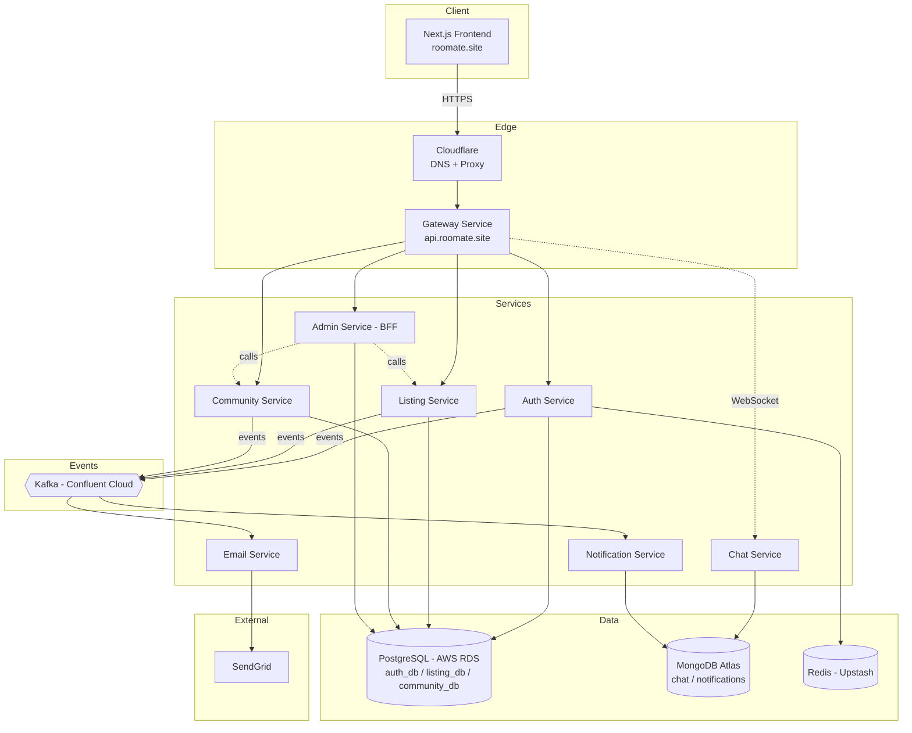

# Architecture

*Task Z02 — 26/05/2026*

## Why Microservices?

1. **I'm a student learning** — and RooMate's domains naturally fit microservices, so it's the right project to learn on.
2. **Different services do different things.** Chat needs WebSockets. Listings needs fast filters. Email is fire-and-forget. One process can't tune for all of them.
3. **Ship one thing at a time.** Fix an email template without redeploying chat.
4. **Clean boundaries.** Auth, Listings, Community, Chat, Admin — each owns its own domain. No tangled mess.
5. **One service crashing ≠ whole app down.** Chat dies, users can still browse and log in.

---

## The Services

RooMate runs as **8 independent services**. A **Gateway** sits in front of everything as the single entry point the frontend talks to, so no individual service is ever exposed directly to the internet.

| # | Service | Owns | DB |
|---|---|---|---|
| 1 | **Gateway** | Routing, CORS, single entry point for the frontend | — |
| 2 | **Auth** | Users, sessions, roles | PostgreSQL |
| 3 | **Listing** | Properties, photos, amenities | PostgreSQL |
| 4 | **Community** | Communities, posts, comments | PostgreSQL |
| 5 | **Chat** | Conversations, messages | MongoDB |
| 6 | **Admin** (BFF) | Audit log, approval orchestration | PostgreSQL* |
| 7 | **Notification** | In-app notifications (Kafka consumer) | MongoDB |
| 8 | **Email** | Email dispatch (Kafka consumer) | — |

*\*Admin's own audit log lives alongside the other Postgres databases; it doesn't own listing/community/user data — see below.*

---

## Service Breakdown

- **Gateway** — The single entry point the frontend ever talks to (`api.roomate.site`). Handles routing to the right backend service, CORS, and keeps every other service off the public internet.
- **Auth** — Handles signup, login, sessions, and user roles. Owns the users table. Issues JWTs, stores sessions in Redis, emits `UserCreated` events.
- **Listing** — Manages property CRUD (create, read, update, delete) with filters like rent, location, amenities, gender preference. Every listing is admin-approved before going live.
- **Community** — Reddit-style. Communities (admin-approved, open join), with typed posts inside them (roommate / question / local_info / for_sale) and comments. Users can request a new community.
- **Chat** — 1:1 conversations triggered from either a property listing or a community post. Real-time via WebSockets. Messages stored in MongoDB.
- **Admin (BFF)** — *Thin BFF = Backend-For-Frontend.* It doesn't own any business data. It just calls the other services (Listing, Community) on behalf of the admin dashboard — approve listing, approve community, reject, etc. The only thing it owns is the **audit log** that records every admin action. One backend, one job: serve the admin UI cleanly.
- **Notification (Kafka consumer)** — Listens to events on Kafka (`property.approved`, `community.approved`, etc.) and creates in-app notifications stored in MongoDB. Exposes a read/unread API.
- **Email (Kafka consumer)** — Listens to the same events and sends transactional emails. Stateless, no DB.

---

## Architecture Diagram

**Reading the diagram:**
- The frontend never talks to any service except the Gateway — every request flows through Cloudflare → Gateway → the right backend service.
- **Admin doesn't own listing or community data.** It calls those services directly (dotted lines) to perform approvals, and only writes to its own audit log.
- **Kafka decouples side effects.** When a listing gets approved, the Listing service doesn't know or care who's listening — it just emits `property.approved`. Email and Notification independently consume that event and react. Neither service needs to know the other exists.
- **Chat and Notification use MongoDB**, not Postgres — messages and notification feeds are high-write, less relational, and fit a document store better than a relational table.
