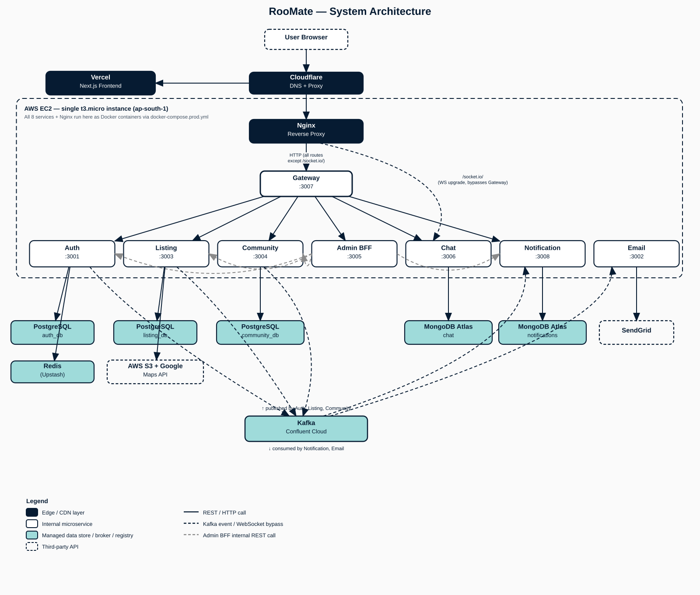

# Architecture

RooMate is built as 8 independent NestJS microservices behind a single API gateway, with a Next.js frontend, event-driven communication over Kafka, and a database-per-service model. This doc walks through how it's actually put together and why it ended up this way — the reasoning behind the pivot from a monolith is in [`motivation.md`](motivation.md).

## System overview

A few things this diagram is hiding on purpose, explained below: how services actually talk to each other, why the databases are split the way they are, and what's sitting behind Nginx on EC2.

## Why 8 separate services

Each service owns one clear responsibility and nothing else:

| Service | Responsible for |
|---|---|
| Gateway | Single entry point, request routing, CORS, auth guard |
| Auth | Signup, login, JWT issuing/refresh, email verification |
| Listing | Property CRUD, search, filters |
| Community | Roommate communities, join requests |
| Admin BFF | Approve/reject listings and communities (backend-for-frontend over other services) |
| Chat | Real-time messaging over WebSocket |
| Notification | In-app notification feed |
| Email | Transactional emails, Kafka consumer |

The frontend only ever talks to the Gateway. It has no idea Auth, Listing, and Chat are separate processes — the Gateway is the only thing that routes internally. This is what actually let me build and deploy each service independently, without every change risking the whole app.

## Database per service

Auth, Listing, and Community each get their own isolated PostgreSQL database on RDS — `auth_db`, `listing_db`, `community_db` — with no shared tables and no service reaching into another service's database directly. Chat and Notification use MongoDB Atlas instead, because messages and notification feeds are high-write, loosely structured data that doesn't fit relational tables well.

This is the one rule I was strictest about while building this. It's tempting to just let one service peek into another's table when you're short on time, but that's exactly what turns "microservices" into a monolith with extra network calls. If a service needs data it doesn't own, it either asks that service directly (REST) or reacts to an event that service published (Kafka) — never a shared table.

## How services talk to each other

Two patterns, used for different reasons:

- **REST, service-to-service** — for anything synchronous, where one service needs a direct answer right now (e.g. Gateway needs Auth to validate a token before routing a request further, or Admin BFF calling Auth/Listing/Community/Notification directly to approve or reject something).
- **Kafka events** — for anything where a service just needs to *react* to something happening elsewhere, without the original service needing to know or care who's listening. Auth, Listing, and Community all publish events; Notification and Email both consume them independently.

That second pattern is what actually solves the coupling problem. Without it, Listing would need to directly call Email and Notification every time something happened, and adding a ninth service that also cares about approvals would mean touching Listing's code again. With Kafka, it just subscribes to the same event.

## Infrastructure layout

- **Frontend** — Next.js, deployed on Vercel, auto-deploys from `main`.
- **Backend** — all 8 services and Nginx run as Docker containers on a single AWS EC2 instance (`t3.micro`, `ap-south-1` / Mumbai), managed via `docker-compose.prod.yml`.
- **Databases** — AWS RDS PostgreSQL (3 isolated databases) + MongoDB Atlas for Chat and Notification.
- **Cache** — Redis via Upstash, used by the Auth service.
- **Messaging** — Kafka via Confluent Cloud, for all cross-service events.
- **File storage & maps** — AWS S3 for listing images, Google Maps API for location data — both used by the Listing service.
- **Email delivery** — SendGrid, triggered by the Email service consuming Kafka events.
- **Reverse proxy** — Nginx on the EC2 instance, sitting behind Cloudflare, routes standard HTTP traffic to the Gateway and routes `/socket.io/` WebSocket upgrade requests straight to Chat, bypassing the Gateway entirely.
- **DNS + edge** — Cloudflare sits in front of `api.roomate.site`, handling DNS and proxying — so the EC2 instance's raw IP is never exposed directly.
- **Container registry & CI/CD** — images are built and pushed to AWS ECR via GitHub Actions, then pulled onto the EC2 instance during deploy. The full pipeline gets its own diagram and write-up in [`deployment.md`](deployment.md).
- **Logging** — CloudWatch, across all 8 services.

## Trade-offs, honestly

Running 8 services on a single `t3.micro` isn't how you'd do this at real scale — it's one instance, so there's no actual service isolation at the infrastructure level even though there's isolation at the code and database level. If that instance goes down, everything goes down together. I know this, and it was a conscious trade-off: the point of this project was to learn and demonstrate real microservices patterns (service boundaries, event-driven communication, independent deploys), not to build out a multi-instance, auto-scaled production setup on a student budget. Scaling this properly — separate instances or a container orchestrator like Kubernetes or ECS — is covered in [`future-scope.md`](future-scope.md).

---

*See also: [Motivation](motivation.md) · [Tech Stack](tech-stack.md) · [ER Diagram](er-diagram.md) · [Deployment](deployment.md) · [Deployment Experience](deployment-experience.md)*
