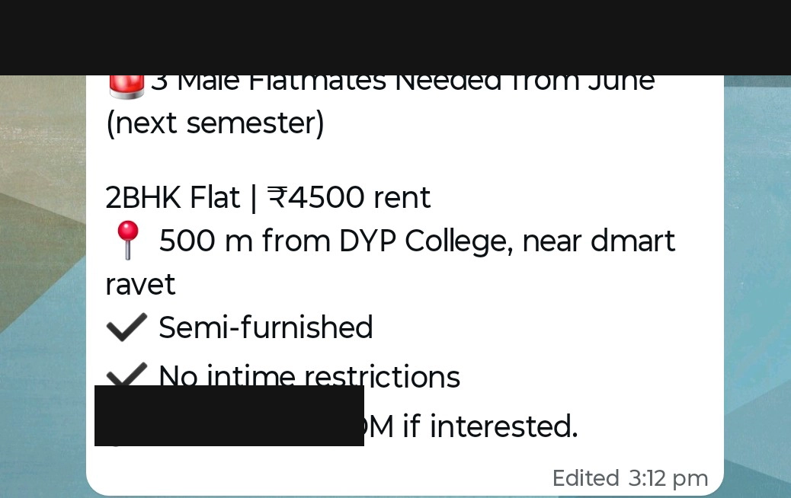
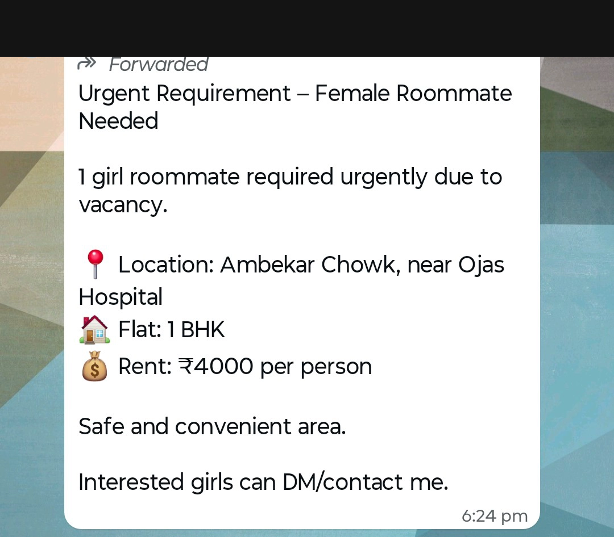
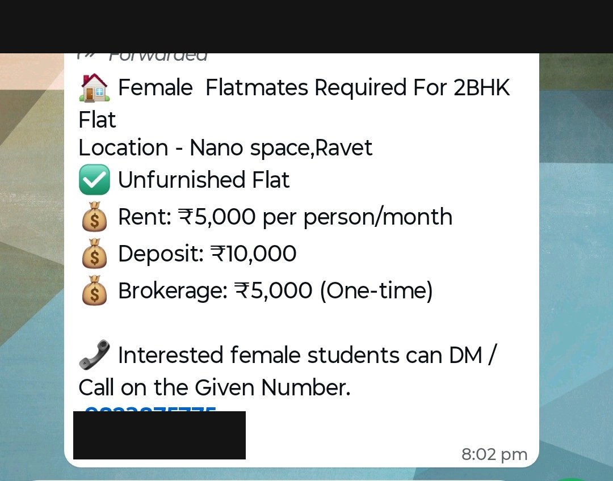
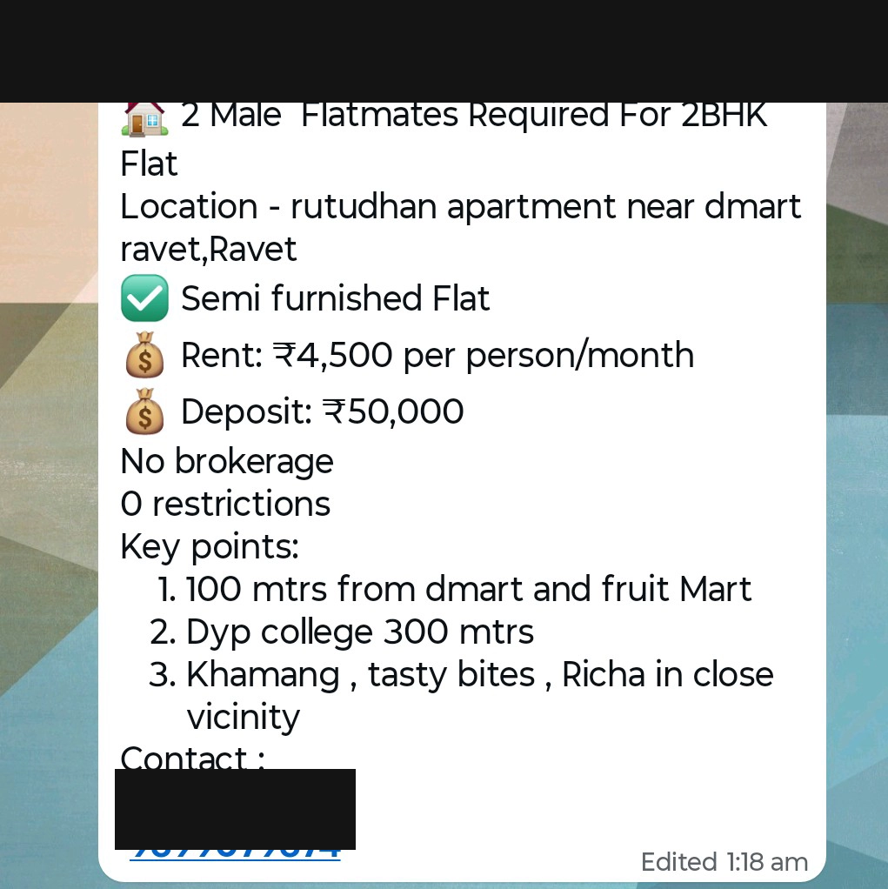
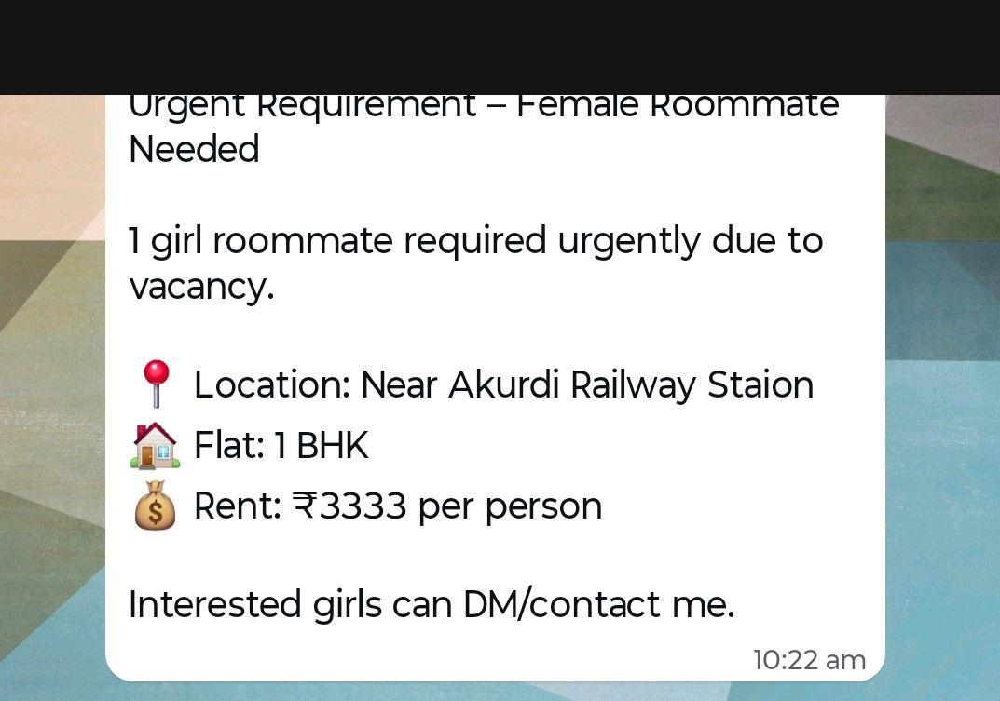

# Why RooMate

## How this actually started

One of my close friends moved to a new city for college. She didn't know a single person there. Her parents wanted the best place for her, and they wanted it fast — so they ended up paying not one, but multiple brokers, just to find her a room. That's basically the whole problem in one story: families paying a stranger a month's rent in commission because there's no better way to search.

For most students, the "better way" is a WhatsApp group. Here are actual forwarded messages from Pune college groups (names and numbers blurred out) — and this is not rare, hundreds of messages like this show up every single day with zero way to search, filter, or verify any of it:

If a message gets posted at 9 and you check the group at 9:30, it's already gone. If you're not in the right group in the right city at the right time, you just never see it at all. The people who need this the most end up with the worst tools, and pay a broker to fix that.

## Why not just use 99acres or NoBroker

That's literally the first question I asked myself, so before writing a single line of code I asked my friends about it — they were my actual users before RooMate was even a project. Every one of them said the same thing in different words: those platforms are made for families looking for full flats, not for a student trying to find one bed in a 3BHK near college.

A family filtering by school zones and a 19-year-old looking for a room near campus are not the same person, and platforms trying to serve both end up serving neither well. That's the one thing I decided RooMate had to get right: **build only for students and bachelors, nothing else.** Not a general listings site with a "student" filter added on top — just one platform, one type of user, so it doesn't get confusing or feel like it's for someone else.

## Why I switched to microservices

I didn't start out building this as microservices. The first version was a plain Node.js monolith. Honestly, the switch wasn't some grand system design decision from day one — it happened because the folder structure kept getting messier and messier, and every change I made in one place somehow broke something in another. I didn't even have the right words for why it felt wrong yet.

That frustration is what actually got me reading about system design and service boundaries in the first place. Once I understood what microservices were actually solving, it clicked — RooMate's listings, chat, community, and notifications really are separate concerns with different rules, and building them as one giant app was fighting that instead of working with it. So I rebuilt it — Node to NestJS, one monolith to eight services. That whole rebuild is written up in [`architecture.md`](architecture.md).

## Where this stands right now

RooMate isn't some finished, market-tested product, and I'm not pretending it is. It's live, it works, people can actually use it — but it started from one friend's bad experience and a bunch of honest conversations with people around me, not a formal study. If you've run into this problem yourself, or you think RooMate is getting something wrong, I'd genuinely like to hear it. Reach out on [GitHub](https://github.com/ShreyaGosavi), [LinkedIn](#), or by email(shreya.p.gosavi@gmail.com).

---

*See also: [Architecture](architecture.md) · [Tech Stack](tech-stack.md) · [Journey](journey.md)*
