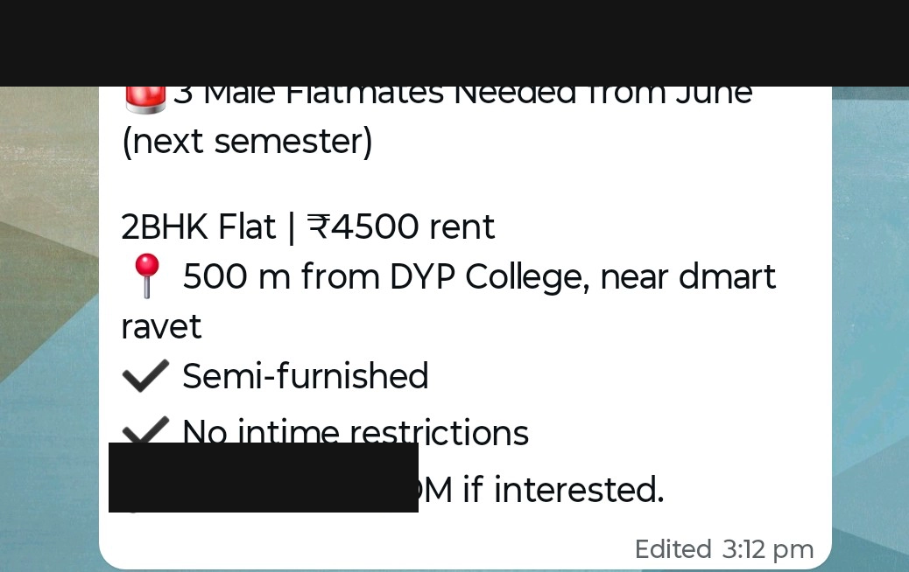
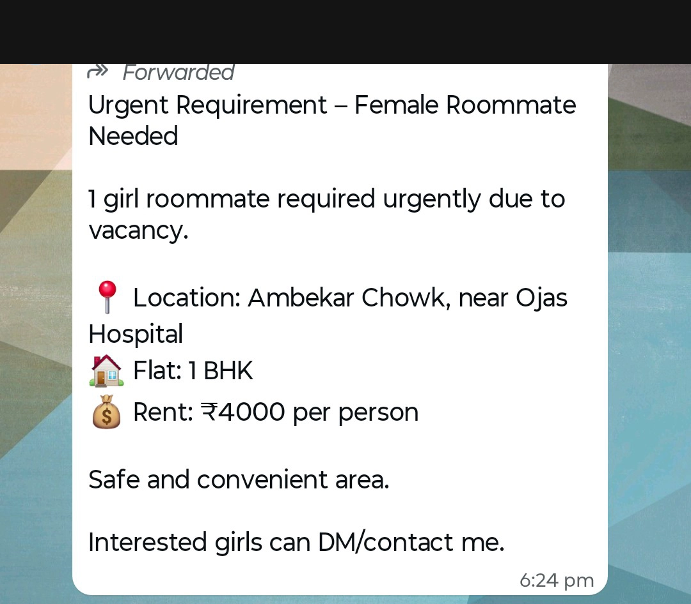
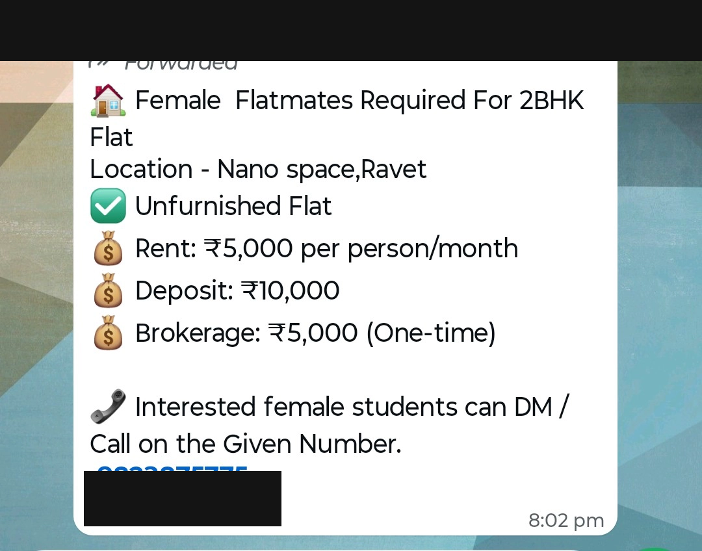
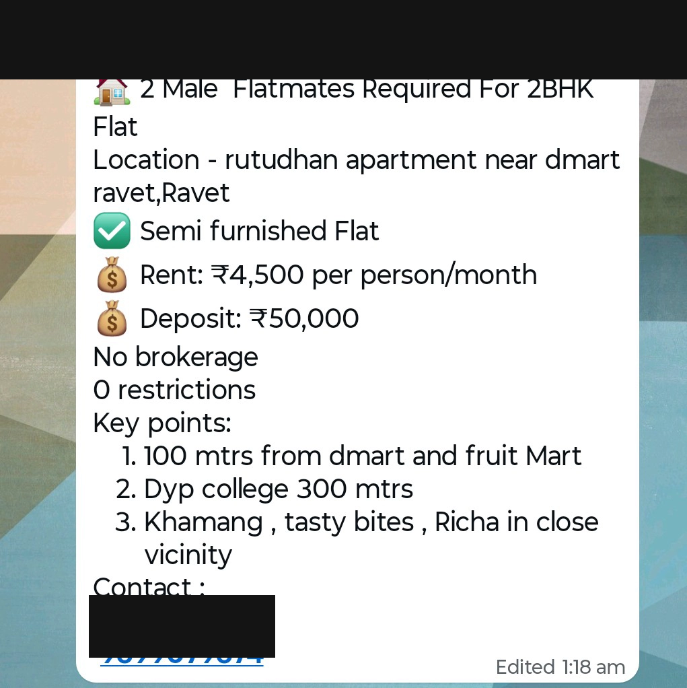
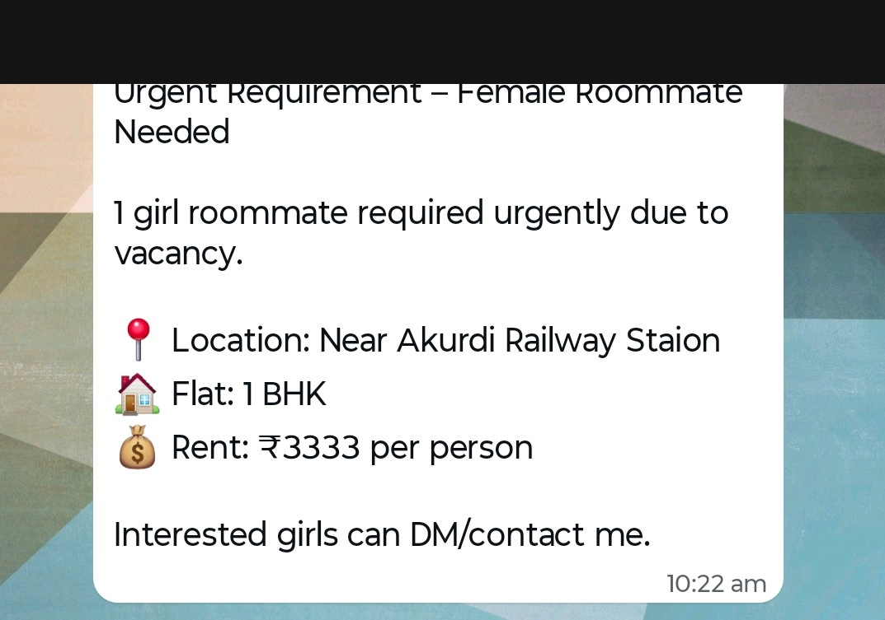

# The Problem and the Solution

*Task Z01 — 25/05/2026*

## The Problem

Every year, lakhs of college students and working bachelors move to new cities for studies or jobs. The first thing they need — a place to stay — is also the most frustrating thing to find.

Today, the search looks like this:

- **WhatsApp groups filled with unstructured messages.** A typical college group has dozens of "1 roommate needed" or "2BHK available" posts that get buried within hours. If you didn't see the message in the first 30 minutes, it's gone.
- **Limited reach.** A WhatsApp group is only as good as who's in it. If the right roommate is in a different group, college, or city — you'll never reach them. The medium itself caps the audience.
- **Brokers** who charge one month's rent as commission, often for properties you could have found yourself.
- **Existing platforms** like 99acres, NoBroker, and MagicBricks exist, but they are built for families looking at full apartments or for buying property. They aren't built for a 19-year-old looking for one bed in a 3BHK near their college, or a 24-year-old looking for a roommate.

The result: the people who need this most — students and bachelors on a budget — end up using the worst tools (random WhatsApp groups and cold DMs that go nowhere) because nothing else is built for them.

### What this actually looks like

These are real forwarded messages from Pune college WhatsApp groups (names and phone numbers redacted) — and many more just like them flood these groups every single day, with no way to search, filter, or verify any of it:

  
  
  

  
  
  

## Who is Affected

- **College students** moving away from home for the first time, often in an unfamiliar city, with limited budgets.
- **Working bachelors** in their first or second job, looking for shared accommodation close to their office — shared rent means a better location and better facilities on a lower budget.
- **Property owners** who rent to this demographic but currently rely on word-of-mouth, brokers, or chaotic WhatsApp groups to find tenants.
- **People with a flat but looking for a roommate** — a category nobody serves directly today. They aren't listing a property, but they have a vacancy. Existing platforms have no place for them.

## Proposed Solution

**RooMate** is a focused platform for student and bachelor accommodation. Not for families. Not for buying property. Just hostels, PGs, shared flats, and finding roommates.

1. **Verified property listings** — owners list their PGs and shared flats directly, with the details that actually matter to this audience (rent per person, semi-furnished or fully, restrictions, distance from nearby colleges/offices).
2. **Roommate noticeboard and community support** — for the people in the gap above. If you need a roommate, you post there. College- or workplace-based groups where users can ask questions, share local knowledge ("is this society safe at night?", "how's the water supply?", "need a fridge on rent", "which mess is best in the locality?"), and get real answers from people who actually live there.
3. **In-platform chat** — so the conversation happens in one place.
4. **AI-assisted search** — instead of clicking 10 filters, you describe what you want in one line ("budget 6k, near DY Patil, female-only, wifi and laundry") and the platform surfaces what fits.
5. **Secure authentication** — only verified users can post or message, which kills the spam and fake listings that plague WhatsApp groups.
6. **Rent payment** — so paying the owner and splitting rent is easy.

## MVP Staging

### MVP 1 — Foundation
- Secure authentication
- Verified property listings
- Roommate noticeboard and community support

**Goal:** a user can sign up, browse listings, and post on the noticeboard.

### MVP 2 — Conversation & Discovery
- In-platform chat
- AI-assisted search

**Goal:** users can talk to each other without leaving the app, and find what they want in one sentence instead of ten filters.

### MVP 3 — Money
- Rent payment (to owner + splitting)

**Goal:** close the loop. The platform handles the full journey, end to end.

---

> **Where the build stands today:** MVP 1 and MVP 2 are fully built and deployed — authentication, verified listings, the community noticeboard, real-time chat, and AI-assisted search are all live at [roomate.site](https://roomate.site). MVP 3 (rent payment) is the next planned milestone.
